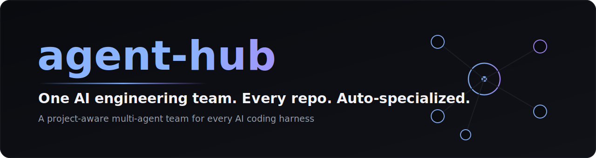
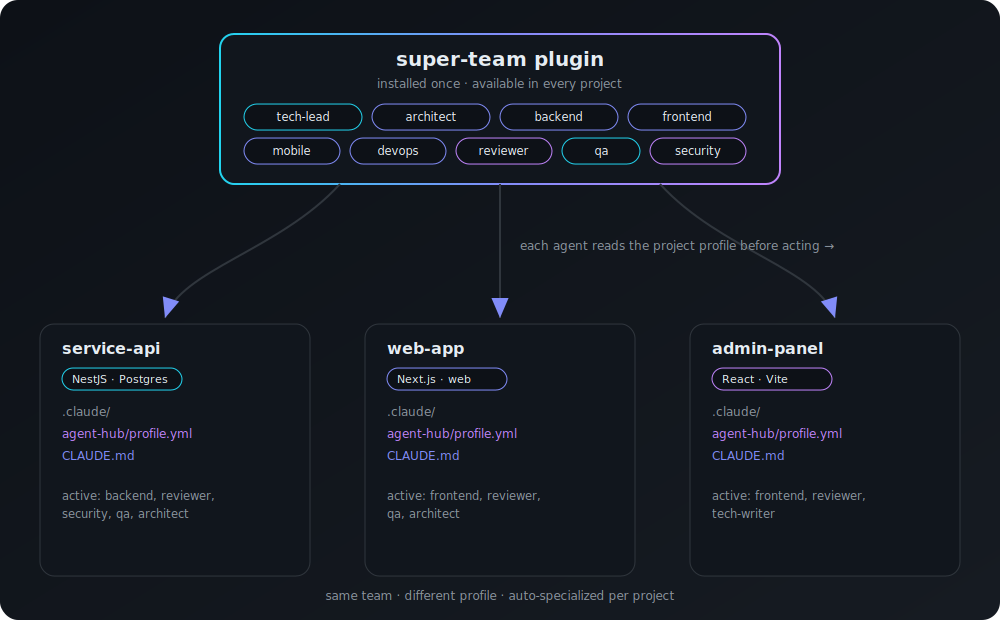

<div align="center">



**One AI engineering team. Every repo. Auto-specialized.**

A project-aware multi-agent super-team for [Claude Code](https://claude.com/claude-code).
Install once — then every project gets a full-stack team that adapts to *that* project's
stack, commands, and conventions.

[](https://github.com/berkcangumusisik/agent-hub/actions/workflows/validate.yml)
[](LICENSE)
[](https://code.claude.com/docs/en/plugins)
[](CONTRIBUTING.md)

[Install](#-install) · [How it works](#-how-it-works) · [The roster](#-the-roster) · [Contribute](CONTRIBUTING.md)

</div>

---

## ✨ The idea

You don't want a different assistant per project. You want **one great team** that *knows*
which project it's in.

> Open Claude Code in a backend repo → the team thinks in your backend stack.
> Open it in a web repo → the same team thinks in your frontend stack.
> Same roster. Different brain. **Zero manual switching.**

The magic is a tiny per-project file the whole team reads before acting. Claude Code
auto-loads it when you open the project — so specialization is automatic.

```text
~/my-service  ❯ "add rate limiting to the login endpoint"
   tech-lead reads .claude/agent-hub/profile.yml  → your stack · framework · pkg manager
   ├─ architect    designs the guard + token-bucket store
   ├─ backend-eng  implements it in your framework
   ├─ security     checks auth bypass & lockout edge cases
   └─ code-review  signs off
```

## 🎬 See it

<div align="center">



*`/onboard` detects the stack, then `tech-lead` routes the work to the right specialists.*

</div>

## 🚀 Install

```bash
/plugin marketplace add berkcangumusisik/agent-hub
/plugin install super-team@agent-hub
```

That's it — the team is now available in **every** project on your machine.

## 🧭 Use it in a project

From inside any project directory:

```bash
/onboard      # detects your stack, scaffolds the project profile
```

This writes `.claude/agent-hub/profile.yml` + `.claude/CLAUDE.md`. Review the detected
values, fix anything wrong, and you're done. From then on, just describe what you want —
**`tech-lead`** routes the work to the right specialists.

```bash
/team         # show the roster and who's active for this project
```

## 🧠 How it works



Two layers:

1. **The super-team** *(this repo, a Claude Code plugin)* — a roster of specialist
   subagents. Installed once, present everywhere.
2. **The project profile** *(per project)* — a `.claude/agent-hub/profile.yml` +
   `CLAUDE.md` describing the project's stack, commands, and conventions.

Every agent runs a **Profile-first protocol**: read the profile before doing anything, then
act in *that* project's idioms. Because Claude Code auto-loads a project's `CLAUDE.md` when
you open it there, switching projects switches the team's behavior — automatically.

## 👥 The roster

| Agent | Role | Model |
|---|---|---|
| `tech-lead` | Orchestrator — decomposes work, routes to specialists | `opus` |
| `architect` | System design, data models, API contracts, trade-offs | `opus` |
| `backend-engineer` | APIs, business logic, persistence, integrations | `sonnet` |
| `frontend-engineer` | Web UI, state, accessibility, performance | `sonnet` |
| `mobile-engineer` | Native / cross-platform mobile | `sonnet` |
| `devops-engineer` | CI/CD, infra, containers, observability | `sonnet` |
| `code-reviewer` | Correctness, bugs, maintainability review | `sonnet` |
| `qa-tester` | Test plans and test code | `haiku` |
| `security-reviewer` | Vulnerabilities, authz/authn, secrets (defensive) | `opus` |
| `tech-writer` | Docs, READMEs, changelogs | `haiku` |

Models are tuned per role for a quality/cost balance — override any of them in the agent's
frontmatter.

## 📄 The profile

`.claude/agent-hub/profile.yml` is the single source of truth a project hands the team:

```yaml
project:
  name: my-service
  type: backend
stack:
  language: TypeScript
  framework: NestJS
  database: PostgreSQL
  packageManager: pnpm
commands:
  install: pnpm install
  test: pnpm test
team:
  active: [tech-lead, architect, backend-engineer, code-reviewer, security-reviewer]
conventions:
  - Use the repository pattern for data access
doNot:
  - Never expose entities directly in API responses
```

A starter template lives in [`templates/project-profile/`](templates/project-profile/) —
or just run `/onboard` and let the team fill it from your codebase.

## 🗂 Repo layout

```text
agent-hub/
├── .claude-plugin/marketplace.json     # marketplace manifest
├── plugins/super-team/                 # the plugin
│   ├── .claude-plugin/plugin.json
│   ├── agents/                         # the 10 specialists
│   ├── skills/                         # agent-hub-init, load-profile
│   └── commands/                       # /onboard, /team
├── templates/project-profile/          # per-project .claude/ starter
└── scripts/validate.mjs                # zero-dep CI validation
```

## ❓ FAQ

<details>
<summary><b>Do I have to fill the profile by hand?</b></summary>

No. `/onboard` inspects your repo (`package.json`, `pom.xml`, `pubspec.yaml`, CI config…)
and fills the profile for you. You just confirm.
</details>

<details>
<summary><b>How is this different from just using subagents?</b></summary>

Plain subagents are global and stack-agnostic. agent-hub makes one team **project-aware**:
the same roster reads each project's profile and adapts, so you don't maintain a separate
set of agents per repo.
</details>

<details>
<summary><b>Can I add or remove specialists?</b></summary>

Yes — per project via `team.active` in the profile, or globally by editing the roster.
See [CONTRIBUTING](CONTRIBUTING.md) to add a new specialist.
</details>

<details>
<summary><b>Does it work with my stack?</b></summary>

It's stack-agnostic — the agents derive everything from your profile. Node, Java, Python,
Dart, Go… if Claude Code can read it, the team can work in it.
</details>

## 🛣 Roadmap

- [ ] Starter templates for more stacks (Spring Boot, Django, Go, Expo)
- [ ] `/handoff` command to summarize state for the next session
- [ ] Optional `data-engineer` and `ux-designer` specialists
- [ ] Profile linting in `/onboard`

Have an idea? [Open an issue](https://github.com/berkcangumusisik/agent-hub/issues) or a PR.

## 🤝 Contributing

PRs of every size are welcome — a sharper agent prompt, a new specialist, an example
profile. Run `node scripts/validate.mjs` before pushing. See [CONTRIBUTING.md](CONTRIBUTING.md).

## ⭐ Like it?

If agent-hub saves you time, **star the repo** — it helps others find it and motivates the
roadmap.

## 📝 License

[MIT](LICENSE) © [Berkcan Gümüşışık](https://github.com/berkcangumusisik)
